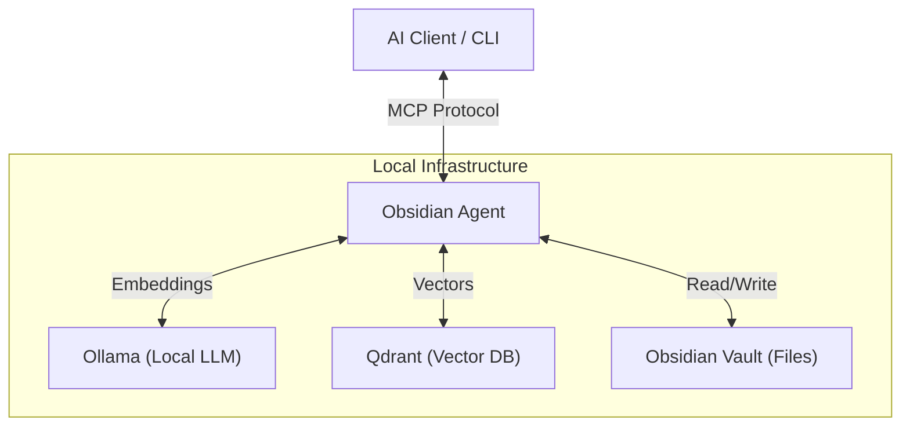

# Obsidian Agent

A powerful, privacy-first AI agent for your Obsidian vault.

Obsidian Agent connects your personal knowledge base to AI workflows. It provides a CLI for managing your notes and an MCP (Model Context Protocol) server to let agents like Claude and Gemini read, write, and reason about your Obsidian vault.


## Features

- **Local Intelligence**: Uses local embeddings (Ollama) and vector storage (Qdrant) for 100% private semantic search.
- **Bi-Directional**: Not just RAG—agents can create notes, link concepts, and append to your daily log.
- **Universal Connector**: Exposes your vault via [Model Context Protocol (MCP)](https://modelcontextprotocol.io/).
- **Lightweight**: Optimized to run on low-power hardware like a Raspberry Pi Zero.
- **Gardener Tools**: Tools for finding orphans, suggesting tags, and maintaining vault health.

## Installation

### Prerequisites

- [Go](https://go.dev/dl/) 1.25+
- [Docker](https://docs.docker.com/get-docker/) & Docker Compose

### Quick Start

1.  **Clone the repository:**
    ```bash
    git clone https://github.com/chadmowery/obsidian-agent.git
    cd obsidian-agent
    ```

2.  **Configure your environment:**
    ```bash
    cp .env.example .env
    # Edit .env and set OBSIDIAN_VAULT_PATH=/path/to/your/vault
    ```

3.  **Run the automated setup:**
    ```bash
    make setup
    ```
    This single command will:
    - Build and install the CLI tool (`obsidian-cli`)
    - Start the vector database (Qdrant) and LLM service (Ollama)
    - Pull the embedding model (`nomic-embed-text`)

4.  **Index your vault:**
    ```bash
    obsidian-cli index
    ```

## Usage

### CLI

The `obsidian-cli` is your command-line swiss army knife.

```bash
# Semantic search for concepts
obsidian-cli search-semantic "machine learning architecture"

# Ask questions about your notes (RAG)
obsidian-cli ask "What did I learn about rust macros?"

# View vault stats
obsidian-cli stats

# Find orphan notes
obsidian-cli orphans
```

**Tip**: To avoid passing `--vault` everywhere, add this to your shell profile (`~/.zshrc`):
```bash
export OBSIDIAN_VAULT_PATH=/path/to/your/vault
```

### MCP Server (AI Integration)

To use your vault with Claude Desktop or Gemini, configure the MCP server.

#### Claude Desktop

Add to `~/Library/Application Support/Claude/claude_desktop_config.json`:

```json
{
  "mcpServers": {
    "obsidian": {
      "command": "/path/to/obsidian-cli",
      "args": ["server"],
      "env": {
        "OBSIDIAN_VAULT_PATH": "/absolute/path/to/your/vault",
        "USE_OLLAMA": "true"
      }
    }
  }
}
```

## Architecture



The system is designed for privacy and local-first operation. All embeddings are generated locally using Ollama, and vector data is stored in a local Qdrant instance managed via Docker.

## License

MIT License - see [LICENSE](LICENSE) for details.
